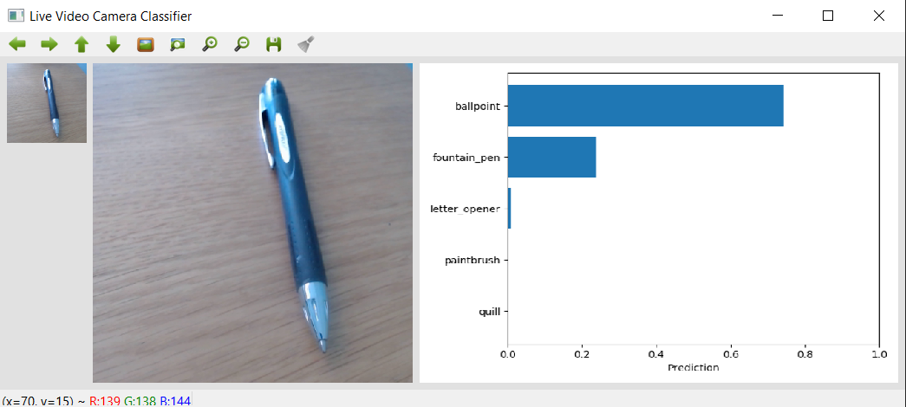

# simple-image-classification

This repository contains:

* `simple_image_classification.ipynb`: A Jupyter notebook to perform basic image classification and display the results in order to test adversarial images
* `simple_video_classification.py`: Python script to capture live video feed and perform image classification 
* `images` folder containing sample images and adversarial patches (developed by engineers at [www.roke.co.uk](www.roke.co.uk))

## Setting up your environment

Instructions for setting up your enviornment to run the code are in [GETTING_STARTED.md](GETTING_STARTED.md)

## Running the video classifier

From within an Anaconda Command Prompt, ensure that you are within the correct environment (see [GETTING_STARTED.md](GETTING_STARTED.md))

```
conda activate simple-image-classification
```

Navigate to the folder containing the clone of this repository and type:

```
python simple_video_classificattion.py
```

A window like this should display:


Resize the window and ensure that it is the primary focus (click on it).

Point your web camera in the direction of the scene that you would like to capture and press `c` on the keyboard. You should see something like this:



Press `c` each time you want to update the scene being classified.

Press `q` to quit.

## Running the image classifier


From within an Anaconda Command Prompt, ensure that you are within the correct environment (see [GETTING_STARTED.md](GETTING_STARTED.md))

```
conda activate simple-image-classification
```

Navigate to the folder containing the clone of this repository and type:

```
jupyter notebook
```

Here's a good [introduction to Jupyter notebooks](https://jupyter-notebook-beginner-guide.readthedocs.io)

When running the Jupyter notebooks, the correct kernel ```Python (simple-image-classification)``` (created in the one time step previously). This is selectable via a drop down at the top right of the Jupyter notebook interface.
